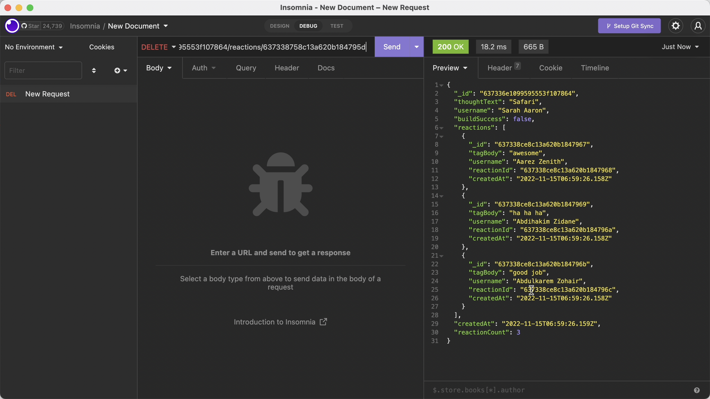

# 18 NoSQL (MongoDB): Social Network API

## User Story

```md
AS A social media startup
I WANT an API for my social network that uses a NoSQL database
SO THAT my website can handle large amounts of unstructured data
```

## Description

In this assignment, I have developed an API for a social network web application where users can share their thoughts, react to friends’ thoughts, and create a friend list. I have used Express.js for routing, a MongoDB database, and the Mongoose ODM. Also, I have used a JavaScript date library/native JavaScript `Date` object to format timestamps.

The application does the following:

-  GIVEN a social network API, when I enter the command to invoke the application then my server is started and the Mongoose models are synced to the MongoDB database.

- When I open API GET routes in Insomnia for users and thoughts, then the data for each of these routes is displayed in a formatted JSON.

- When I test API POST, PUT, and DELETE routes in Insomnia, then I am able to successfully create, update, and delete users and thoughts in my database.

- When I test API POST and DELETE routes in Insomnia, then I am able to successfully create and delete reactions to thoughts and add and remove friends to a user’s friend list.

## Installation Instructions

In order to run the app, we need to run the following commands:

- npm i - This will install the node modules.
- npm run seed - This will seed the database.
- npm start - This will run the app on the localhost (in Insomnia).

Screenshots:


